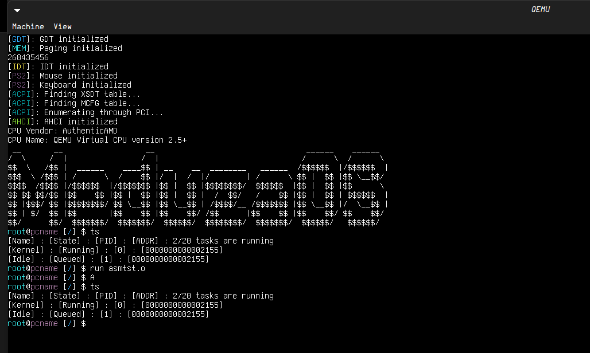
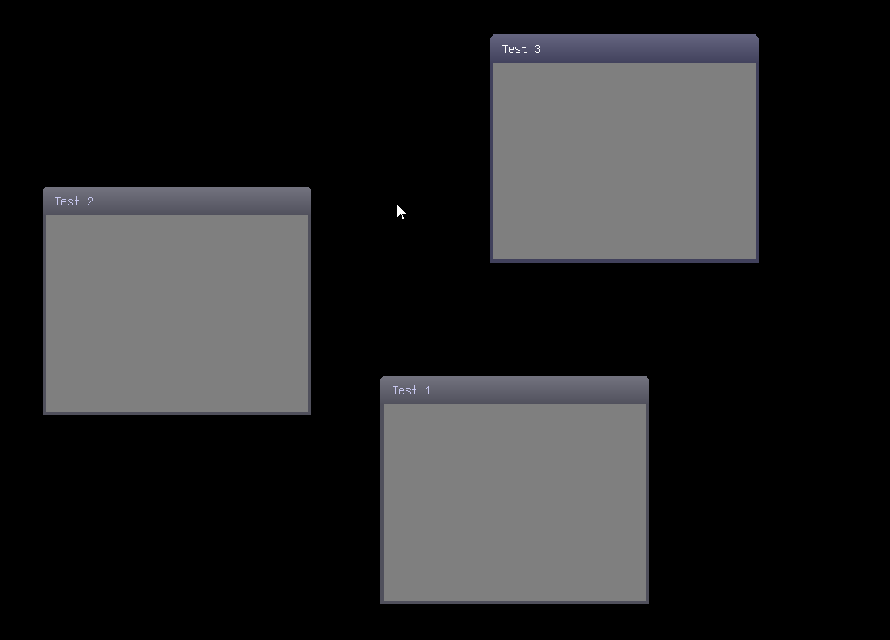

# MeduzaOS (UEFI)
## Current features
- [x] GDT
- [x] IDT
- [x] Heap
- [x] Basic ACPI support (no rebbot or shutdown)
- [x] PCI
- [x] AHCI from PCI
- [x] Custom Filesystem (MeduzaFS)
- [x] Syscalls
- [x] Can run ELF programs

## Building
### Prerequisites
- QEMU (emulator)
- NASM (assembler)
- GCC and G++
- WSL2 (for Windows users)

### Build Instructions (x86_64)
1. Run:
```bash
./run.sh
```

That is all! If you get an "Access denied" error, run this in a terminal:
```bash
chmod +x ./run.sh
```

## Other
### Pictures

